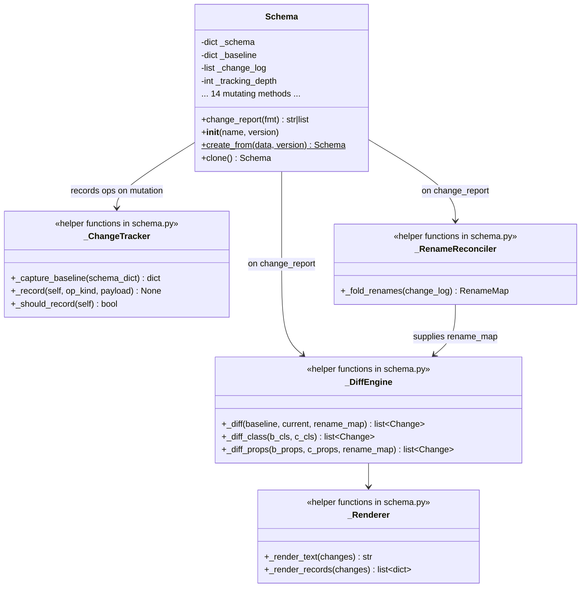
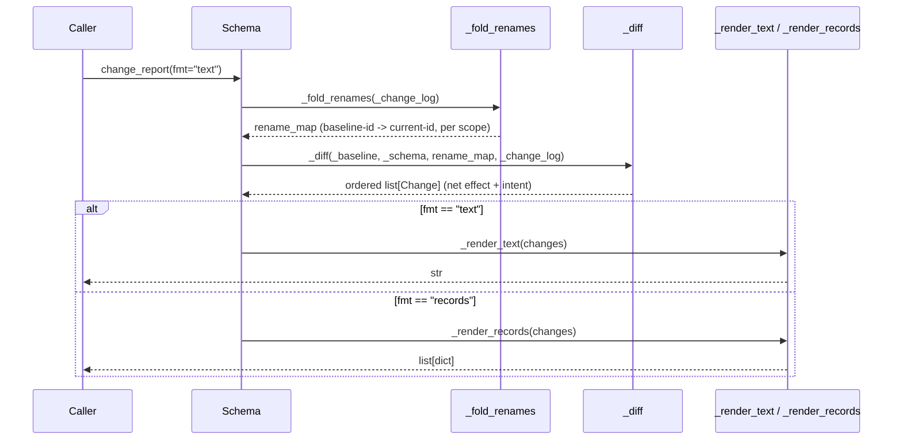
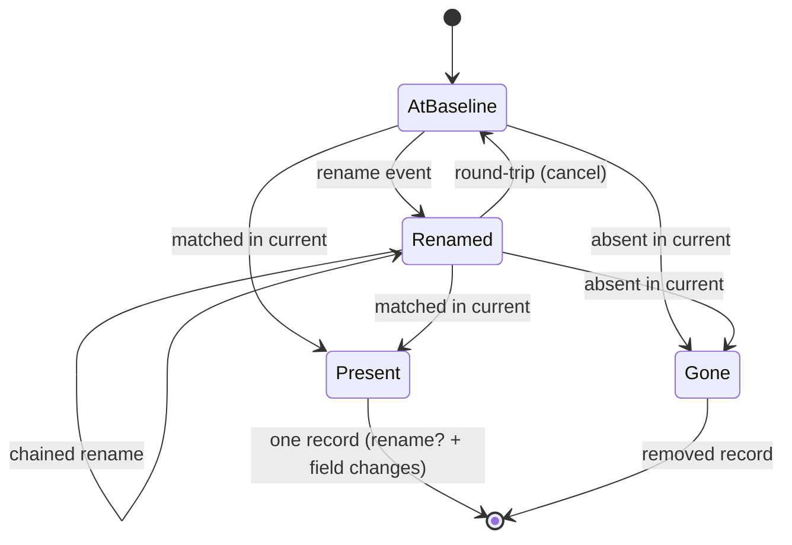

<!-- agent: architect; model_used: claude-opus-4-8[1m]; timestamp_utc: 2026-06-02T10:45:00Z -->

# Plan — Schema Change Tracking & Reporting

## Objective

Give `Schema` (`src/datagraphs/schema.py`) always-on, in-memory change tracking
and a single `change_report(fmt="text"|"records")` method that emits a
deterministic, net-effect, semantically-annotated changelog of everything an
editing session did to the model — accurate enough to attach to a migration
without hand-editing — with **zero change** to existing public signatures,
behaviour, or wire format.

Architecture is fixed by three ADRs produced with this plan:

- **docs/adr/0001** — Hybrid: baseline↔current diff is the source of structural
  truth; a public-boundary op-log supplies semantic intent (rename, reorder,
  compound, label-property).
- **docs/adr/0002** — Op-log entries are recorded only at the outermost
  public-call boundary (re-entrancy depth counter), on success only.
- **docs/adr/0003** — Entity identity is reconciled through renames (op-log
  rename events folded into a baseline→current name map) before diffing, so
  renames, combined rename+modify, and round-trips are handled correctly.

## Scope

### In scope
- `src/datagraphs/schema.py`: tracking state in `__init__` / `create_from` /
  `clone`; instrumentation of the 14 public mutating methods; the diff engine;
  the rename-reconciliation layer; the annotation layer; the `change_report`
  method and its text + records renderers.
- `tests/schema_test.py`: new test classes covering tracking, diff, renames,
  compound ops, no-op collapse, error paths, encapsulation, determinism, and
  backward compatibility.
- `CHANGELOG.md`: an "Added" entry under a new unreleased/minor version.

### Out of scope
- Any change to `client.py`, `dataset.py`, `gateway.py`, `enums.py`,
  `utils.py`. No auto-logging on `apply_schema`.
- A `reset_history()` / re-baseline method (baseline is construction-scoped).
- Markdown or JSON-string output formats (text + records only).
- Server-side / cross-instance history; persistence of the log.
- New top-level export from `__init__.py` (`change_report` is a method on the
  already-exported `Schema`; no export needed).

## Architecture Overview

### Component diagram (new subsystem inside `schema.py`)



All helpers live in `schema.py` (stdlib only). They may be module-level private
functions taking explicit arguments (preferred for testability) or private
methods; the change map specifies private module functions plus thin private
methods on `Schema` that hold the per-instance state.

### `change_report()` flow



### Identity lifecycle through renames (ADR 0003)



## Data / Interface Contract

### Public API addition

```python
def change_report(self, fmt: str = "text") -> str | list[dict]:
    """Return a net-effect changelog of all changes since construction.

    :param fmt: "text" (default) -> deterministic plain-text changelog (str);
                "records" -> structured list[dict] for programmatic use.
    :raises ValueError: if fmt is not "text" or "records".
    """
```

- `fmt="text"` returns a `str`. `fmt="records"` returns a `list[dict]`.
- Invalid `fmt` raises `ValueError` (a stdlib exception; not schema-domain).
- The method is read-only: it never mutates `_schema`, `_baseline`, or
  `_change_log`.

### Structured record shape (`fmt="records"`)

Each entry is a `dict` with a fixed, documented key set. Keys absent for a
given entry are **omitted** (not `None`) to keep records compact and stable:

| key       | type            | meaning |
|-----------|-----------------|---------|
| `target`  | `str`           | dotted path: `ClassName` or `ClassName.propName` (current name) |
| `kind`    | `str`           | `"class"` or `"property"` or `"metadata"` |
| `op`      | `str`           | one of `added`, `removed`, `modified`, `renamed`, `reordered`, `subclass_created` |
| `from`    | `str`           | (renames only) previous name |
| `to`      | `str`           | (renames only) new name |
| `fields`  | `list[dict]`    | (modified only) `[{"field": str, "before": Any, "after": Any}, ...]` |
| `detail`  | `dict`          | (compound/label/reorder) e.g. `{"parent": "Substance", "inherited": 6}` or `{"order": [...]}` or `{"label_property": "name"}` |

Records are ordered identically to text lines (see Determinism). `op` is the
**net** operation; e.g. a renamed-and-modified property emits a single record
with `op="renamed"`, `from`, `to`, and `fields`.

### Internal change object

A lightweight internal `Change` (a `dataclass` or a plain dict — the change map
uses a `@dataclass(frozen=True)` for clarity and ordering) carrying the same
information, converted to the record dict / text line by the renderers. Using a
frozen dataclass keeps ordering keys explicit and the renderers pure.

### State added to `Schema` (private, never serialised)

- `self._baseline: dict` — deep copy of `self._schema` captured once the
  instance is fully constructed (post-legacy-transform).
- `self._change_log: list[dict]` — ordered op records
  `{"op": str, "args": {...}}` appended at the public boundary on success.
- `self._tracking_depth: int` — re-entrancy counter (ADR 0002).

None of these appear in `to_dict()` (which still returns the live `self._schema`
unchanged) or `to_json()`.

## Implementation Phases

### Phase 1 — Tracking state + recording infrastructure (no report yet)

**Objective.** Add baseline capture and the op-log recording mechanism without
changing any observable behaviour.

**Scope.**
- `__init__`: after `update_schema_metadata(...)`, initialise
  `self._change_log = []`, `self._tracking_depth = 0`, and capture
  `self._baseline = _capture_baseline(self._schema)` (deep copy via
  `json.loads(json.dumps(...))`, matching the existing `clone()` idiom).
- `create_from`: baseline must reflect the **post-transform** dict. Capture the
  baseline at the end of `create_from` / `_set_internal_schema` so legacy
  conversion and the initial `update_schema_metadata` are *not* reported.
  Concretely: re-capture `schema._baseline` after `_set_internal_schema` runs.
- `clone`: returns `Schema.create_from(...)`, which already re-captures a fresh
  baseline → a clone starts at 0 changes (requirement satisfied for free; add a
  test to pin it).
- Add private `_capture_baseline(schema_dict) -> dict`.
- Add private recording helper `_record(self, op, **args)` and a re-entrancy
  guard. Recommended shape: a private context manager
  `_track(self)` used as `with self._track() as outermost:` at the top of each
  mutating method, where `outermost` is `True` only when entered at depth 0;
  the method calls `self._record(...)` *only if* `outermost` and the body did
  not raise. Implement with `try/finally` so depth is always restored.

**Dependencies.** None (stdlib `json` already imported).

**Exit criteria.**
- `Schema()` and `Schema.create_from(data)` both expose `_baseline`,
  `_change_log == []`, `_tracking_depth == 0`.
- `to_dict()` / `to_json()` output is byte-identical to pre-change output for
  the same inputs (no tracking keys leak).
- Full existing `tests/schema_test.py` suite passes unchanged.

**Validation checks.** Run `pytest tests/schema_test.py`; assert
`"_baseline" not in schema.to_dict()` and tracking attrs are private.

**Rollback.** Phase is additive and inert; revert the diff.

### Phase 2 — Instrument the 14 public mutating methods

**Objective.** Populate the op-log with exactly one entry per outermost public
mutation, on success, with enough args to drive intent annotation.

**Scope.** Wrap each of the following with the `_track` guard and a
`self._record(...)` call (recorded only when outermost + success). Args captured
are the *intent-bearing* ones (names, new names, target class/prop, compound
flags) — **not** field values (fields come from the diff per ADR 0001):

| method | recorded op | recorded args |
|--------|-------------|---------------|
| `create_class` | `create_class` | `{class_name}` |
| `create_subclass` | `create_subclass` | `{class_name, parent_class_name}` |
| `update_class` | `update_class` | `{class_name, new_name}` (rename if `new_name`) |
| `delete_class` | `delete_class` | `{class_name, cascade_to_subclasses}` |
| `assign_label_property` | `assign_label_property` | `{class_name, prop_name}` |
| `assign_label_autogen` | `assign_label_autogen` | `{class_name}` |
| `assign_baseclass` | `assign_baseclass` | `{class_name, parent_class_name}` |
| `assign_class_description` | `assign_class_description` | `{class_name}` |
| `create_property` | `create_property` | `{class_name, prop_name}` |
| `update_property` | `update_property` | `{class_name, prop_name}` |
| `rename_property` | `rename_property` | `{class_name, old_prop_name, new_prop_name}` |
| `delete_property` | `delete_property` | `{class_name, prop_name}` |
| `assign_property_orders` | `assign_property_orders` | `{property_orders}` (copy) |
| `update_schema_metadata` | `update_schema_metadata` | `{name, version}` |

**Critical ordering / re-entrancy notes (ADR 0002).**
- `create_subclass` calls `create_class` + `create_property`×N internally; the
  inner calls enter at depth ≥ 1 and record nothing. Only the outer
  `create_subclass` records. Same for `create_property`/`update_property` with
  `apply_to_subclasses=True`.
- `update_schema_metadata` is called by `__init__` and `_set_internal_schema`
  **before** the baseline is captured and `_change_log` initialised. Guard the
  recording so it is a no-op until tracking state exists (e.g. record only if
  `getattr(self, "_change_log", None) is not None`), preventing
  `AttributeError` during construction and ensuring construction-time metadata
  is never logged.
- The success-only rule: place `self._record(...)` as the last statement of the
  `try` body (after the real work) so any raised exception skips it; the
  `finally` only decrements depth.

**Dependencies.** Phase 1.

**Exit criteria.**
- A single `create_subclass(...)` produces exactly one `create_subclass` op-log
  entry (not class + N props).
- `create_property(..., apply_to_subclasses=True)` produces one entry.
- A mutation that raises appends nothing.
- Construction (`Schema()`, `create_from`) appends nothing.

**Validation checks.** New unit tests assert `len(schema._change_log)` after
each scenario; error-path tests assert no entry after a raise.

**Rollback.** Revert; methods return to un-instrumented behaviour.

### Phase 3 — Diff engine (structural net effect, name-keyed)

**Objective.** Compute the structural net-effect delta between baseline and
current, excluding date noise, ignoring identity-through-rename for now (added
in Phase 4).

**Scope.** Private functions:
- `_diff(baseline, current, rename_map=None) -> list[Change]`.
- Top-level metadata: compare `name` and `version`-bearing `name` string and
  any non-date top-level fields; **exclude** `createdDate` and
  `lastModifiedDate` from all comparison. Emit a `metadata` change when `name`
  differs.
- Classes: build name-keyed maps `{cls_name: cls_def}` for baseline and current
  (O(n)). Added = current−baseline; removed = baseline−current; common = diff
  each class.
- Per class: diff class-level fields (`subClassOf`, `labelProperty`,
  `description`, `isAbstract`, `identifierProperty`) → field-level
  before→after, omitting unchanged fields and date fields.
- Properties within a class: name-keyed maps; added/removed/modified; modified
  emits only the fields that changed (`isOptional`, `isArray`, `range`, `type`,
  `isLangString`, `description`, `isLabelSynonym`, `isFilterable`,
  `validationRules`, `inverseOf`, etc.), normalising description dicts to text
  for the before/after display.
- Reorder detection: compare the ordered list of property names within a class;
  if the *set* is unchanged but the *sequence* differs, mark a candidate
  reorder (final reorder annotation reconciled with op-log in Phase 5).

**Dependencies.** Phase 1 (baseline exists).

**Exit criteria.**
- `_diff` returns correct add/remove/modify for classes and properties on
  hand-built fixtures.
- Date fields never appear in any change.
- create-then-delete of a class yields no entry (net effect).

**Validation checks.** Unit tests on `_diff` with synthetic baseline/current
dicts; assert no date-derived entries.

**Rollback.** Pure additive helpers; revert.

### Phase 4 — Rename reconciliation (identity through renames, ADR 0003)

**Objective.** Fold op-log rename events into a baseline→current identity map so
the diff matches entities by identity, producing rename labels, combined
rename+modify records, and round-trip collapse.

**Scope.** Private functions:
- `_fold_renames(change_log) -> RenameMap` where `RenameMap` holds:
  - class renames: ordered composition of `update_class` events that set
    `new_name`, yielding `{baseline_class_name: current_class_name}` with
    chained renames composed and round-trips dropped (entry removed when
    baseline name == final name).
  - property renames: `rename_property` events, scoped by the class's
    **canonical/baseline** identity (resolve the event's `class_name` back
    through the class rename map), yielding
    `{(baseline_class, baseline_prop): current_prop}`, chains composed,
    round-trips dropped.
- Integrate into `_diff`: when matching baseline→current entities, consult the
  rename map. If a baseline class maps to a differently-named current class,
  match them by identity, emit `op="renamed"` (`from`/`to`), and merge any
  field-level modifications into that same record. Same for properties, scoped
  by canonical class identity.
- Round-trip: a baseline name that maps back to itself produces no rename label;
  if no field changed either, no entry at all.
- Untracked `to_dict()` rename: no op-log event exists → not in rename map →
  correctly degrades to remove+add (documented per ADR 0001).

**Dependencies.** Phases 2 (op-log populated) + 3 (diff).

**Exit criteria.**
- `dosage → dose` (via `rename_property`) reports one `renamed` record.
- `dosage → dose` + `update_property(is_optional=...)` reports one record with
  `op="renamed"` and a `fields` entry.
- `A → B → A` reports no entry.
- Class rename via `update_class(new_name=...)` reports a class rename and keeps
  its property renames correctly scoped.
- An untracked rename via `to_dict()` reports remove+add (no rename label).

**Validation checks.** Dedicated rename test class — the heaviest coverage area
per ADR 0003 and the brief's central risk.

**Rollback.** Revert; diff falls back to Phase 3 name-keyed behaviour.

### Phase 5 — Semantic annotation: compound, reorder, label-property

**Objective.** Use the op-log to upgrade raw structural changes to single
semantic entries where intent matters.

**Scope.**
- `create_subclass`: when the op-log has a `create_subclass{class_name,
  parent}` entry and the diff shows that class as added with N properties,
  collapse to a single `subclass_created` record
  (`detail={"parent": ..., "inherited": N}`); suppress the per-property adds for
  that class. (Nice-to-have inherited count comes from N.)
- `apply_to_subclasses` expansions: a single op-log entry exists (boundary
  guard); the diff naturally shows the property on each subclass — annotate the
  parent entry; subclass property-adds remain as ordinary adds (acceptable per
  brief) OR are grouped under a `detail` note. Plan: keep subclass adds as
  ordinary property-add records but reference them in `detail` of the parent
  op; pin exact rendering in tests.
- `assign_label_property`: annotate the resulting `labelProperty` field change +
  the property's `isOptional`→False as a single `label_property` semantic detail
  on the property record rather than two bare field flips.
- `assign_property_orders`: when a reorder candidate (Phase 3) coincides with an
  `assign_property_orders` op-log entry for that class, emit a `reordered`
  record (`detail={"order": [...]}`); a reorder with no add/remove/field change
  is otherwise invisible, so the op-log is required to surface it.
- `delete_class(cascade_to_subclasses=True)`: the stripped `subClassOf` on other
  classes appears as a modification to those classes — leave as-is (acceptable
  per brief) but pin expected rendering in tests.

**Dependencies.** Phase 4.

**Exit criteria.**
- `create_subclass` → one `subclass_created` record, not class + N props.
- Pure reorder → one `reordered` record.
- `assign_label_property` → coherent label-property annotation, not two raw
  field flips.

**Validation checks.** Compound/reorder/label test class.

**Rollback.** Revert; entries degrade to raw structural diff (still truthful).

### Phase 6 — Renderers + `change_report` + determinism

**Objective.** Expose the public method and produce deterministic text/records.

**Scope.**
- `change_report(self, fmt="text")`: validate `fmt`; call `_fold_renames` then
  `_diff`; dispatch to `_render_text` / `_render_records`. Read-only.
- Deterministic ordering (applied to the `list[Change]` before rendering):
  sort by `(kind_rank, class_name, op_rank, target)` where `kind_rank` puts
  metadata first, then classes, then properties; `op_rank` fixes a stable order
  (e.g. added, renamed, modified, reordered, removed). This guarantees
  byte-identical reports for identical mutation sequences regardless of dict
  insertion order.
- `_render_text`: plain-text changelog with an optional header count line
  (`Schema changes (N):`) and per-class grouping; symbols/wording finalised
  here (an Open Question in the brief — resolved in this phase with a fixed,
  tested layout). Proposed line forms:
  - `+ ClassName [new class]` / `+ ClassName [new subclass of Parent] (+6 inherited)`
  - `- ClassName [removed]`
  - `~ ClassName [modified]` then indented field lines
  - `  prop: dosage → dose [renamed]; isOptional: true → false`
  - `  + propName [added]` / `  - propName [removed]`
  - `  properties reordered`
- `_render_records`: emit the record dicts per the contract table above, in the
  same order as the text lines, omitting absent keys.

**Dependencies.** Phases 3–5.

**Exit criteria.**
- `change_report()` and `change_report(fmt="records")` return the documented
  types; invalid `fmt` raises `ValueError`.
- Identical mutation sequences produce byte-identical text and equal records
  (determinism test).
- The brief's happy-path scenario renders as specified (combined rename+modify
  on `Substance`, `Drug [new class]`, `deprecatedCode [removed]`, no date
  churn).

**Validation checks.** Renderer + determinism + scenario tests.

**Rollback.** Revert; `change_report` removed (additive).

### Phase 7 — Docs, CHANGELOG, full-suite green

**Objective.** Finish the job: docstrings, changelog, full verification.

**Scope.**
- Sphinx-style docstrings on `change_report` and any new public-surface detail,
  consistent with the module; document the records shape and the untracked-edit
  behaviour.
- `CHANGELOG.md`: new "Added" entry describing always-on change tracking and
  `change_report(fmt=...)`.
- Run the entire test suite (`pytest`), not just `schema_test.py`, to confirm no
  regressions anywhere; confirm `mypy`/typing if the repo runs it.

**Dependencies.** Phases 1–6.

**Exit criteria.** Whole suite green; CHANGELOG updated; docstrings present.

**Rollback.** Revert the commit (pure library addition; no persisted state).

## Step-by-step Implementation Sequence (with rationale)

1. **Phase 1** state + recording infra first — every later phase depends on a
   baseline and the op-log existing, and it must be proven inert before
   instrumenting methods.
2. **Phase 2** instrument methods — populates the op-log; needs the guard from
   Phase 1. Done before the diff so rename/compound tests have real log data.
3. **Phase 3** diff engine — independent of the op-log (structural truth);
   builds the backbone the annotation layers refine.
4. **Phase 4** rename reconciliation — depends on both op-log (Phase 2) and
   diff (Phase 3); the central risk, isolated so it gets focused tests before
   compound/label logic piles on.
5. **Phase 5** semantic annotation — layered on a correct identity-aware diff.
6. **Phase 6** renderers + public method + determinism — last, so output layout
   is decided once the change model is complete.
7. **Phase 7** docs/changelog/full suite — finish cleanly.

## Change Map

### File: `src/datagraphs/schema.py` (modify)
`adr_refs: 0001, 0002, 0003`

- `Schema.__init__` — initialise `_change_log`, `_tracking_depth`; capture
  `_baseline` after `update_schema_metadata`.
- `Schema.create_from` (and `_set_internal_schema`) — re-capture `_baseline`
  from the post-transform dict so legacy conversion / construction metadata is
  not reported.
- New private `_capture_baseline(schema_dict) -> dict` (deep copy).
- New private recording guard `_track(self)` (context manager, depth counter,
  `try/finally`) and `_record(self, op, **args)`; both no-op when tracking state
  is absent (during construction).
- Instrument (wrap with guard + conditional record) the 14 public mutating
  methods: `create_class`, `create_subclass`, `update_class`, `delete_class`,
  `assign_label_property`, `assign_label_autogen`, `assign_baseclass`,
  `assign_class_description`, `create_property`, `update_property`,
  `rename_property`, `delete_property`, `assign_property_orders`,
  `update_schema_metadata`.
- New private diff layer: `_diff`, `_diff_class_fields`, `_diff_properties`,
  reorder candidate detection; date-field exclusion set
  (`createdDate`, `lastModifiedDate`).
- New private rename layer: `_fold_renames`, `RenameMap` (class + scoped
  property maps; chain composition; round-trip cancellation).
- New private annotation layer: compound (`create_subclass`/
  `apply_to_subclasses`), reorder, label-property collapse.
- New private renderers: `_render_text`, `_render_records`; deterministic
  ordering helper; `Change` frozen dataclass.
- New public method `change_report(self, fmt: str = "text") -> str | list[dict]`.
- `to_dict` / `to_json` — **unchanged** (verify tracking state is never
  serialised).

### File: `tests/schema_test.py` (modify)
`adr_refs: 0001, 0002, 0003`

Add test classes (following existing class-per-area, `setup_method` style):
- `TestChangeTrackingBaseline` — loaded/empty schema starts at 0 changes;
  `clone`/`create_from` reset baseline; tracking attrs not in `to_dict()`.
- `TestChangeTrackingRecording` — op-log populated at boundary; compound ops =
  one entry; `apply_to_subclasses` = one entry; raises record nothing;
  construction records nothing.
- `TestChangeDiff` — class/property add/remove/modify; field-level before→after;
  date fields excluded; create-then-delete collapses.
- `TestChangeRenames` — property rename; class rename; combined rename+modify;
  round-trip collapse; class-rename property scoping; untracked `to_dict()`
  rename → remove+add.
- `TestChangeSemanticAnnotation` — `create_subclass` single entry + inherited
  count; reorder; label-property; cascade delete rendering.
- `TestChangeReportRendering` — text format + header; records shape/keys;
  invalid `fmt` raises `ValueError`; determinism (byte-identical repeats);
  brief happy-path scenario.

### File: `CHANGELOG.md` (modify)
`adr_refs: none`

- New "Added" entry under an unreleased/minor heading: always-on schema change
  tracking and `Schema.change_report(fmt="text"|"records")`.

## API / Data Contract Changes

- **Added:** `Schema.change_report(fmt="text"|"records")` (see contract above).
- **Unchanged:** every existing public signature; `to_dict()` still returns the
  live internal dict; `to_json()` byte-for-byte unchanged; wire format
  untouched. No new top-level export.
- **Records schema:** the fixed-key `list[dict]` documented above (absent keys
  omitted).

## Test Matrix

| Component / behaviour | Test class | Level |
|-----------------------|-----------|-------|
| Baseline at construction = 0 changes | TestChangeTrackingBaseline | unit |
| `clone`/`create_from` reset baseline | TestChangeTrackingBaseline | unit |
| Tracking state excluded from `to_dict`/`to_json` | TestChangeTrackingBaseline | unit |
| Boundary recording / compound = one entry | TestChangeTrackingRecording | unit |
| `apply_to_subclasses` = one entry | TestChangeTrackingRecording | unit |
| Raise → no record | TestChangeTrackingRecording | unit |
| Construction → no record | TestChangeTrackingRecording | unit |
| Class/prop add/remove/modify, field-level | TestChangeDiff | unit |
| Date fields excluded | TestChangeDiff | unit |
| create-then-delete collapse | TestChangeDiff | unit |
| Property rename | TestChangeRenames | unit |
| Class rename | TestChangeRenames | unit |
| Combined rename+modify = one record | TestChangeRenames | unit |
| Rename round-trip collapse | TestChangeRenames | unit |
| Class-rename property scoping | TestChangeRenames | unit |
| Untracked `to_dict()` rename → remove+add | TestChangeRenames | unit |
| `create_subclass` one entry + inherited count | TestChangeSemanticAnnotation | unit |
| Reorder detection | TestChangeSemanticAnnotation | unit |
| Label-property annotation | TestChangeSemanticAnnotation | unit |
| Cascade-delete rendering | TestChangeSemanticAnnotation | unit |
| Text format + header line | TestChangeReportRendering | unit |
| Records shape/keys | TestChangeReportRendering | unit |
| Invalid `fmt` → ValueError | TestChangeReportRendering | unit |
| Determinism (byte-identical repeats) | TestChangeReportRendering | unit |
| Brief happy-path scenario | TestChangeReportRendering | unit |
| Full existing suite still green | (entire `tests/`) | regression |

## Risks and Mitigations

- **Rename reconciliation (central risk, ADR 0003).** Mitigation: isolate in
  Phase 4 with `_fold_renames` as a pure, independently-testable function;
  heaviest test coverage (chains, round-trips, rename+modify, class-rename
  scoping, untracked rename).
- **Compound/recursive double-logging (ADR 0002).** Mitigation: single
  re-entrancy depth guard applied uniformly; explicit tests asserting one entry
  for `create_subclass` and `apply_to_subclasses`.
- **Construction-time recording / `AttributeError`.** `update_schema_metadata`
  runs during `__init__`/`create_from` before tracking state exists.
  Mitigation: `_record` is a no-op when `_change_log` is absent; baseline
  captured *after* construction metadata; explicit "construction records
  nothing" test.
- **Date-field noise.** Mitigation: hard-coded exclusion set
  (`createdDate`, `lastModifiedDate`) in the diff; test asserts no date entries.
- **Reorder invisibility.** A pure reorder has no add/remove/field delta.
  Mitigation: detect via order comparison reconciled with the
  `assign_property_orders` op-log entry (Phase 5).
- **Legacy-format baseline.** `create_from` runs `SchemaTransformer.old_to_new`
  before baseline. Mitigation: capture baseline at the *end* of `create_from`
  (post-transform); legacy-load test asserts 0 changes after load.
- **Backward compatibility.** Mitigation: Phase 1 exit gate requires the full
  existing suite green and `to_dict()`/`to_json()` byte-identical;
  encapsulation test asserts no tracking keys leak.
- **Brief-quality note (gap scrutiny).** The brief is `sdlc-spec`-generated and
  detailed; one genuinely open item is the exact text layout and the precise
  records key set. This plan **resolves** both concretely (layout in Phase 6,
  record schema in the contract table) so they are no longer open at
  implementation time. `version` semantics: the schema stores version only
  inside the composed `name` string (`"<name> v<version>"`) and in the private
  `_version` attr (not in `_schema`), so a "version change" surfaces via the
  `name` metadata diff — the plan reports `name` changes and treats version as
  part of that string, matching the brief's "top-level name/version changes
  reported".

## Observability

Not applicable in the runtime/telemetry sense — this is an in-memory SDK
library addition with no logging, metrics, or alerts. The feature itself *is*
the observability surface for schema migrations: `change_report()` is the
human-/machine-readable record. No new logging is added (the SDK module emits
none today and the brief forbids scope creep into `client.py`).

## Rollout and Rollback

- **Rollout.** Pure backward-compatible library addition; ships in the next
  `pydatagraphs` minor release via the existing PyPI pipeline. No feature flag
  (tracking is always-on per Key Decision 5), no config toggle, no migration.
- **Rollback.** Revert the commit. No persisted state, no wire-format change,
  no server interaction to unwind.
- **Release.** `CHANGELOG.md` "Added" entry; minor semantic version bump;
  branch prefix `feature/`, conventional commit `feat:`.

## Validation Strategy

- Per-phase exit criteria above are the gates.
- Final gate: entire `pytest` suite green (not just `schema_test.py`),
  `to_dict()`/`to_json()` byte-identical for representative inputs, determinism
  test passing, and the brief's four scenario walkthroughs (happy path, no-op
  collapse, compound, error path, untracked edit) each covered by a test.

## ADRs Produced

- `docs/adr/0001-hybrid-baseline-diff-with-oplog-annotation.md`
- `docs/adr/0002-public-boundary-recording-guard.md`
- `docs/adr/0003-rename-identity-reconciliation.md`

## Open Questions (isolated, non-blocking)

- Whether to group `apply_to_subclasses` subclass property-adds under the parent
  op's `detail` or leave them as standalone records — pinned by test in Phase 5;
  either is acceptable per the brief. Default: standalone records, referenced in
  parent `detail`.
- No top-level `__init__.py` export is planned; `change_report` is reachable via
  the already-exported `Schema`. (Resolved: no export.)
