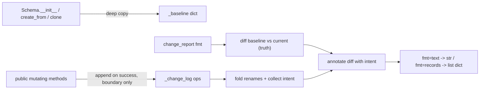

# 0001. Schema change tracking: baseline-diff for truth, op-log for intent

## Context

`Schema` (`src/datagraphs/schema.py`) wraps a single mutable dict
(`self._schema`) that callers edit through ~14 public mutating methods and may
also edit directly via the live dict returned by `to_dict()`. The platform PUT
is wholesale (replace entire model), so neither the SDK nor the server produces
a migration diff. We need a `change_report()` that emits an accurate net-effect
changelog of what an editing session did to the model.

Two structurally different sources of truth are available:

- The **structural delta** between the schema's state at construction
  (baseline) and its current state — robust by construction, captures every
  change including untracked `to_dict()` edits, and naturally collapses no-op
  sequences (create-then-delete, rename round-trips).
- The **chronological log** of public mutating calls — carries *intent* a raw
  diff cannot infer (a rename vs. a remove+add, a reorder, a label-property
  assignment, a compound `create_subclass`), but cannot reliably fold to net
  effect and is blind to untracked edits.

The requirement demands both net-effect accuracy *and* semantic intent. The
question is which source owns "what changed" and how the other contributes.

## Decision Drivers

- Net-effect accuracy must be robust by construction — replaying/folding a log
  to net effect is error-prone (must handle every inverse-pair cancellation).
- Semantic intent (rename, reorder, compound, label assignment) must survive
  into the report; a blind diff renders a rename as remove+add.
- Truthfulness even when callers bypass the tracked API via `to_dict()`.
- Determinism: identical mutation sequences must yield byte-identical reports.
- No new dependencies; stdlib only; no change to wire format or signatures.

## Considered Options

### Option 1 — Pure operation/command log

Record every public mutation; the report replays/folds the log to net effect.

Pros:
- Intent is captured directly at the call site.
- No baseline copy needed.

Cons:
- Folding to net effect requires correctly cancelling every inverse pair
  (create/delete, rename round-trips, modify-then-revert) — fragile and the
  primary source of subtle bugs.
- Completely blind to untracked `to_dict()` edits; report would silently lie.
- update_property only writes non-None fields, so an argument-captured log does
  not even know which fields actually changed without re-diffing.

### Option 2 — Pure baseline snapshot + structural diff

Deep-copy the dict at construction; the report is `diff(baseline, current)`.

Pros:
- Net effect is correct by construction; no-op sequences vanish automatically.
- Captures untracked `to_dict()` edits as raw structural changes.
- O(n) via name-keyed maps.

Cons:
- Loses all semantic intent: renames read as remove+add, reorders are invisible
  (no add/remove/field change), `create_subclass` reads as a class-add plus N
  property-adds, label-property assignment is just a field flip.

### Option 3 — Hybrid: diff for truth, op-log for intent

Baseline-diff is the authoritative net-effect source. A lightweight op-log,
recorded only at the public-call boundary on success, is consulted purely to
**annotate** the diff with intent (rename identity, reorder, compound, label).

Pros:
- Net-effect correctness inherited from the diff (Option 2 strength).
- Intent recovered from the op-log (Option 1 strength) without trusting it for
  structure.
- Stays truthful under untracked `to_dict()` edits — those simply appear as
  un-annotated structural changes.

Cons:
- Two cooperating mechanisms to build and keep consistent.
- Rename reconciliation (mapping baseline identity to current identity by
  folding rename events) is the most intricate part of the implementation.

## Decision Outcome

Chosen option: **Option 3 — Hybrid (diff for truth, op-log for intent)**.

Justification: it is the only option that satisfies both hard requirements —
net-effect accuracy (which the diff guarantees by construction) and semantic
intent (which the op-log supplies). The op-log is deliberately demoted to an
annotation source so that no correctness property of the report depends on
folding the log; this confines the log's fragility to "intent is occasionally
absent" (graceful degradation) rather than "structure is wrong" (a lie). The
behaviour under untracked `to_dict()` edits — raw structural diff with no
semantic label — is the intended, documented contract.

## Consequences

Positive:
- Report structure is correct regardless of how the schema was mutated.
- No-op collapsing and field-level before/after fall out of the diff for free.
- Intent annotations degrade gracefully to raw structure when the op-log lacks
  a matching entry.

Negative / trade-offs accepted:
- One deep copy of the schema dict held per instance for the instance lifetime
  (acceptable: domain models are tens of classes).
- Rename reconciliation logic must be carefully tested (see ADR 0003).

Neutral / follow-ups required:
- `createdDate`/`lastModifiedDate` must be excluded from the diff to avoid
  spurious date entries.
- No new ADRs in `docs/adr/` existed before this plan; this is the first.

## Related ADRs

- Supersedes: none
- Related: docs/adr/0002-public-boundary-recording-guard.md — how the op-log is
  populated without double-logging compound ops.
- Related: docs/adr/0003-rename-identity-reconciliation.md — how the diff is
  keyed by identity rather than current name.

## Diagram

