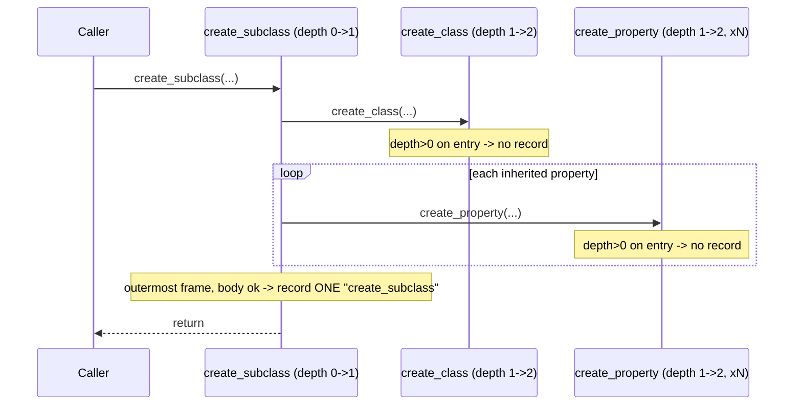

# 0002. Record op-log entries only at the outermost public-call boundary

## Context

Several public mutating methods on `Schema` are **compound**: they call other
public mutating methods internally.

- `create_subclass(class_name, description, parent_class_name)` calls
  `create_class` once and `create_property` once per inherited parent property.
- `create_property(..., apply_to_subclasses=True)` recurses into
  `create_property` for every subclass.
- `update_property(..., apply_to_subclasses=True)` recurses into
  `update_property` for every subclass.

If every public method naively appends an op-log entry on entry/exit, a single
`create_subclass` call produces one `create_class` entry plus N
`create_property` entries, and the report would render the subclass creation as
a class-add plus N property-adds instead of one semantic entry. The op-log must
record the **intent of the call the user actually made**, i.e. only the
outermost public invocation in a re-entrant chain.

A complementary requirement: a mutation that *raises* must record nothing
(record on success only). The depth guard and the success-only rule interact:
the recording decision is made after the inner work succeeds, by the outermost
frame only.

## Decision Drivers

- Compound operations must appear as a single semantic op-log entry.
- Inner self-calls must not contribute their own entries.
- A raising mutation records nothing.
- Must work with Python's single-threaded synchronous call model used by the
  SDK (no async, no threads in `schema.py`); simplicity preferred.
- Zero impact on existing signatures and behaviour.

## Considered Options

### Option 1 — Re-entrancy depth counter on the instance

A private integer `self._tracking_depth`. Each instrumented public method
increments on entry, decrements in a `finally`, and records its op only when it
is the outermost frame (depth was 0 on entry) and the body completed without
raising.

Pros:
- Directly models "outermost public call only".
- Naturally success-only: the record line sits after the body, before the
  decrement, and is skipped on exception.
- Trivial, dependency-free, correct for the synchronous single-threaded SDK.

Cons:
- Every instrumented method must participate consistently (a shared helper /
  decorator mitigates this).

### Option 2 — Refactor compound methods to call private (un-instrumented) cores

Split each compound method into a public wrapper that records, plus a private
`_create_class_core` etc. that does the work; compound methods call the cores.

Pros:
- No depth state; recording is structurally impossible from inner calls.

Cons:
- Large, invasive refactor of stable, tested code (every mutating method
  bifurcated), increasing regression risk against the "no behaviour change"
  constraint.
- Duplicates the public/private boundary that the depth counter expresses in
  one place.

### Option 3 — Post-hoc deduplication of the op-log

Record everything, then heuristically collapse runs that look like a compound
operation when building the report.

Pros:
- Methods stay oblivious to nesting.

Cons:
- Heuristic and fragile; cannot reliably distinguish a genuine
  `create_class` + `create_property` sequence the user issued from a
  `create_subclass` expansion.

## Decision Outcome

Chosen option: **Option 1 — Re-entrancy depth counter on the instance**.

Justification: it models the exact requirement ("record the outermost public
call, on success only") in one small piece of shared state, is correct for the
SDK's synchronous single-threaded execution model, and avoids the regression
risk of refactoring every mutating method (Option 2) or the fragility of
heuristic deduplication (Option 3). A single private helper
(`_record(op_kind, payload)`) plus a `_tracking` context-manager / guard
applied uniformly keeps the instrumentation consistent and self-documenting.

## Consequences

Positive:
- `create_subclass` and `apply_to_subclasses` expansions record exactly one
  entry — the outermost call.
- Exceptions in the body leave the op-log untouched (the record statement is
  never reached) while the `finally` still restores depth.

Negative / trade-offs accepted:
- The depth counter assumes single-threaded use; concurrent mutation of one
  `Schema` instance from multiple threads is already unsupported and remains so.

Neutral / follow-ups required:
- The guard must use `try/finally` so depth is restored even when the body
  raises; the success-only record happens before the `finally` unwinds.

## Related ADRs

- Supersedes: none
- Related: docs/adr/0001-hybrid-baseline-diff-with-oplog-annotation.md — the
  op-log this guard populates.

## Diagram

