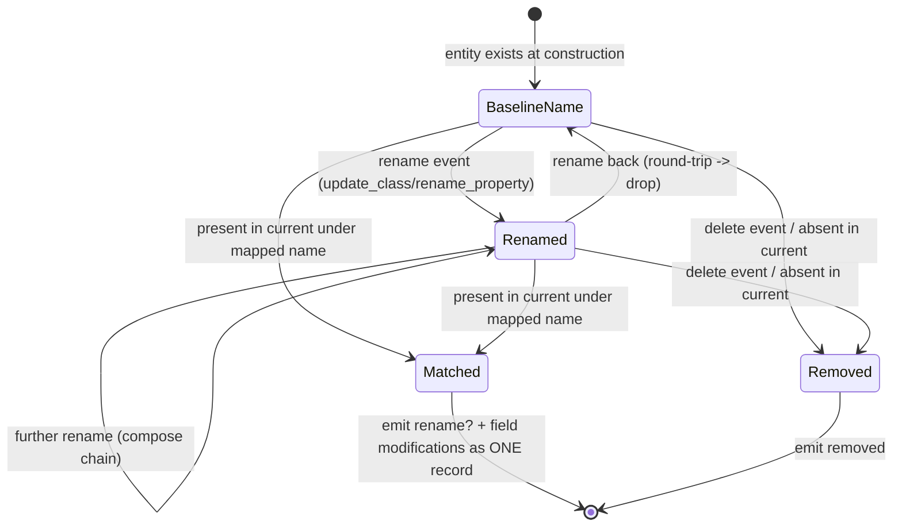

# 0003. Reconcile entity identity through renames before diffing

## Context

The diff (ADR 0001) keys classes and properties by **name**, because names are
the only stable identifier in the schema dict (there is no GUID on the in-memory
new-format dict that survives all operations). But names change: `update_class`
can rename a class, `rename_property` renames a property. A name-keyed diff
alone would render `dosage -> dose` as `dosage [removed]` + `dose [added]`,
defeating the rename requirement, and would fail to combine a rename with a
concurrent field modification into one record.

Worse, a rename round-trip (`A -> B -> A`) and a renamed-and-modified entity
both require knowing the **identity correspondence** between a baseline entity
and a current entity. That correspondence cannot be inferred from the two dict
states alone (they only carry final names); it must come from the op-log's
rename events.

The decision: how to establish baseline-identity to current-identity mapping so
the diff can be computed *by identity* rather than by current name.

## Decision Drivers

- A renamed property/class must read as a rename, not remove+add.
- A renamed-and-modified entity must be one combined record.
- Rename round-trips must collapse to no entry.
- Reconciliation must be deterministic and O(n) over classes/properties.
- The op-log is the only source of rename correspondence; the diff stays the
  source of structural truth (ADR 0001).

## Considered Options

### Option 1 — Fold rename events into a name-mapping, then diff by canonical identity

Walk the op-log's rename events (class renames from `update_class new_name`,
property renames from `rename_property`) in order to build, per scope, a
mapping from **baseline name -> current name** (composing chained renames and
cancelling round-trips). Diff is then computed against canonical identity:
each baseline entity is matched to the current entity its name maps to; the
rename itself is recorded as a `rename` annotation when baseline name differs
from current name; field-level modifications on the same matched entity merge
into the same record.

Pros:
- Directly produces combined rename+modify records and collapses round-trips.
- Deterministic; mapping is built by a single ordered pass over rename events.
- Keeps structural truth in the diff; only identity correspondence comes from
  the log.

Cons:
- Must compose chains correctly (A->B then B->C => A->C) and drop identity maps
  (A->B->A => no rename).
- Property renames are scoped per class, and a class may itself be renamed —
  the property scope key must be the class's canonical identity.

### Option 2 — Heuristic structural matching (match removed+added by shape)

When the diff sees a removed entity and an added entity with identical field
content, guess they are a rename.

Pros:
- Needs no op-log.

Cons:
- Ambiguous and unsound: two genuinely independent add/remove of similar shape
  would be mislabelled a rename; a rename that also changed fields would not
  match. Violates the "truth from diff, intent from log" principle.

### Option 3 — Track a synthetic stable id on each entity at baseline

Stamp a hidden id onto every class/property and carry it through renames.

Pros:
- Identity is explicit and unambiguous.

Cons:
- Pollutes the schema dict and risks leaking into `to_dict()`/wire format
  (explicitly forbidden by the brief); requires stamping on entities created
  after baseline too; far more invasive than folding the existing rename log.

## Decision Outcome

Chosen option: **Option 1 — Fold rename events into a baseline->current name
mapping, then diff by canonical identity**.

Justification: it satisfies every rename requirement (rename labelling,
combined rename+modify, round-trip collapse) using only the op-log already
mandated by ADR 0001 for intent, keeps structural truth in the diff, adds no
state to the schema dict (so the wire format is untouched per the brief), and
is deterministic and O(n). Heuristic matching (Option 2) is unsound; synthetic
ids (Option 3) violate the no-wire-format-change constraint.

## Consequences

Positive:
- Renamed-and-modified entities collapse into a single record.
- Rename round-trips produce no entry.
- No change to the serialised schema.

Negative / trade-offs accepted:
- Reconciliation is the most intricate code path and demands the heaviest test
  coverage (chained renames, round-trips, rename + modify, class-rename
  changing a property's scope key, untracked `to_dict()` rename which has no
  log event and therefore correctly degrades to remove+add).

Neutral / follow-ups required:
- Property-scope keys are resolved against the class's canonical (baseline)
  identity so a class rename does not orphan its property renames.
- An untracked rename via `to_dict()` has no op-log event and is intentionally
  reported as remove+add (documented behaviour, ADR 0001).

## Related ADRs

- Supersedes: none
- Related: docs/adr/0001-hybrid-baseline-diff-with-oplog-annotation.md
- Related: docs/adr/0002-public-boundary-recording-guard.md — guarantees the
  rename events in the log are the user-issued ones, not inner expansions.

## Diagram

